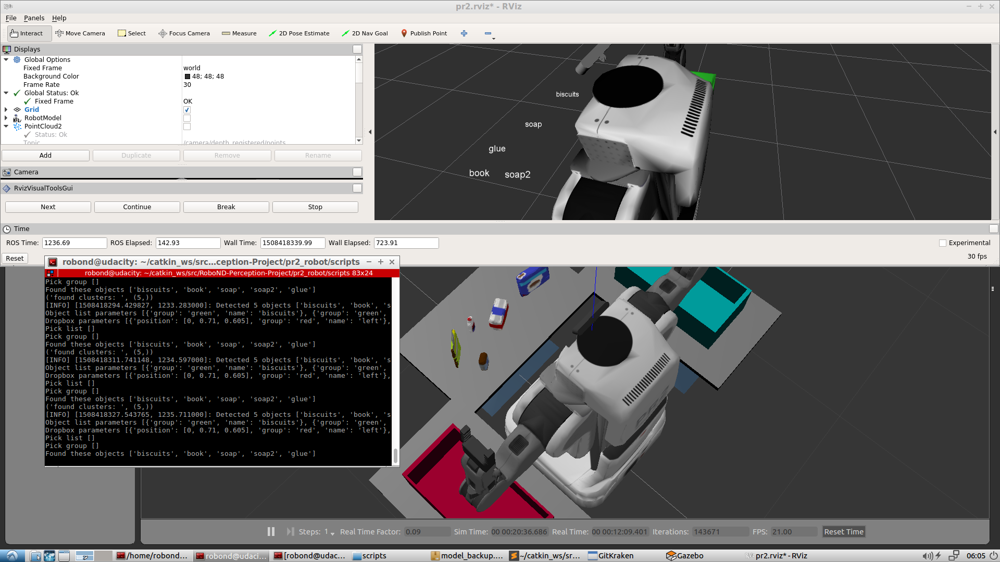

# Project: Perception Pick & Place
Writeup for the Pick&Place Project handed in by Ulrich Ludmann


---


## [Rubric](https://review.udacity.com/#!/rubrics/1067/view) Points
### Here I will consider the rubric points individually and describe how I addressed each point in my implementation.  

---
## Writeup / README

The challenge in this Project is to implement a perception pipeline into a given ROS Environment. In the End it should recognize all Objects on the Table and provide a yaml file that contains the centroids of Objects, which are requested by the server.


### Segmentation
We are provided by a ros pont cloud, that needs be converted to the pcl format before we can apply or processing.
```python
cloud = ros_to_pcl(pcl_msg)
```

#### Statistical outlier filter
It turns out that the point cloud is noisy. So the first Step in our perception pipeline is to remove the outliers with a statistical outlier filter.

```python
outlier_filter = cloud.make_statistical_outlier_filter()
outlier_filter.set_mean_k(10) #set number of neighboring points to analyze
outlier_filter.set_std_dev_mul_thresh(0.003) # any point with a mean distance larger rhan global(mean distance+x * std dev) will be considered as a outlier
cloud_filtered = outlier_filter.filter()
statistical_filter_pub.publish(pcl_to_ros(cloud_filtered)) #publish filtered pointcloud
```

#### Voxel Grid

Then we can apply a voxel grid filter to reduce the amount of points in the pointcloud. When we reduce this amount, the processing is faster.

```python
vox = cloud_filtered.make_voxel_grid_filter()
LEAF_SIZE = 0.01 #turned out to be a reasonable numer. smaller = more points in the cluster = more cpu power needed
vox.set_leaf_size(LEAF_SIZE, LEAF_SIZE, LEAF_SIZE)
vox_filtered = vox.filter()
vox_filter_pub.publish(pcl_to_ros(vox_filtered))
```

#### Passthrough filtering

We know the place where our objects are located (on the table). That means, we can ignore everything else outside of these borders. So its possible to apply a passthrough filter in 2 directions.


#### Filter the Table out

After the passthrough we can Separate the Objects on the table from the table.

#### Euclidean Clustering

As we now see the objects on the table, it is possible to measure the distances between the points and cluster them by their relative positions. This is the last step in Segmentation.


## Recognition
We recognize the Objects by their color and shape.

### SVM Feature Extraction and Training
Before a classification can be applied, I had to train the classifier. I trained a SVM Classifier many times to see what parameters were the best. It turned out that 300 samples of each object and a bin size of 64 in the histogram classifier were the best. I sampled the color histograms and the normal histograms (to account for the shape of the object).
I decided to go for the sigmoid Kernel. After approximately 10 tries with different parameters this classifier turned out to be the most stable one.

My final confusion matrix looks like this:


## Screenshots of the recognition
### world 1

### world 2

### world 3
world 3 is really challenging for my algorithm but in 50% of the cases it recognizes all objects correctly. 


### Pick and Place Setup
The Object Recognition works quiet OK. I couldnt really figure out which gazebo-parameters influence the stability of the recognition. Sometime it is possible to recognize 100% of the objects in world3 - sometimes 1 Object is wrong  I could recognize that more samples lead to a better recognition and also hsv is far better to recognize objects.
Also I played around with the SVM kernels. Here I tried linear, rbf and sigmoid.
Rbf worked fine in the exercises but not in the project. Linear performed not that good.
Its possible to convert into other colorspaces and try to get a better performance for the perception. But my VM performes very poor and so it takes a lot of efford to go on. After term 1 I'll try to install ubuntu natively.
